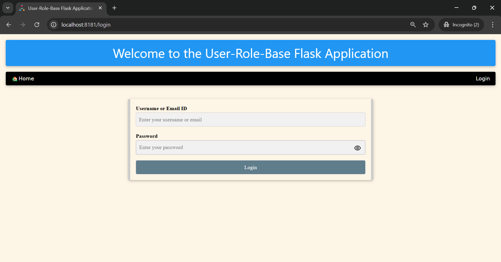
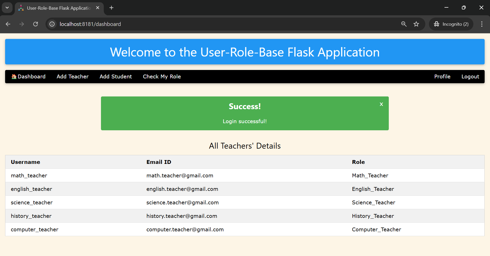
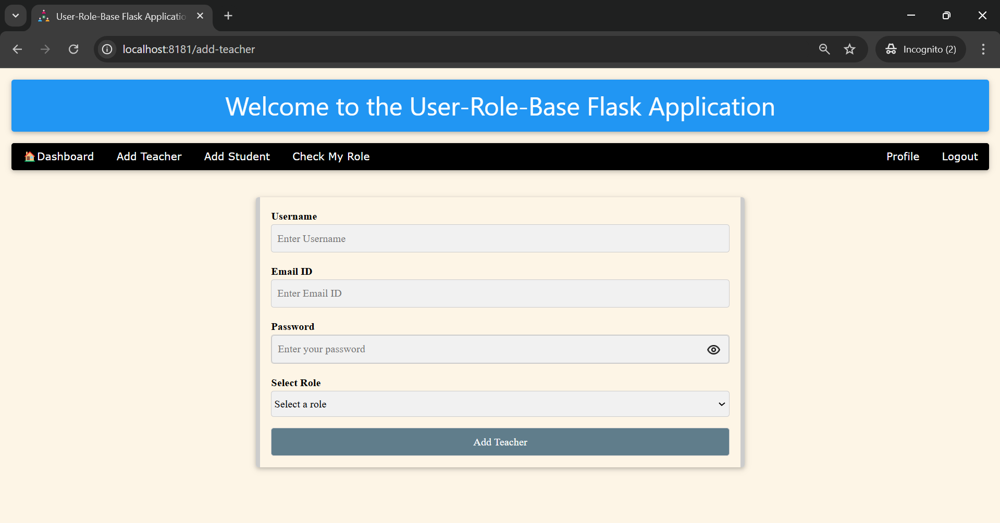
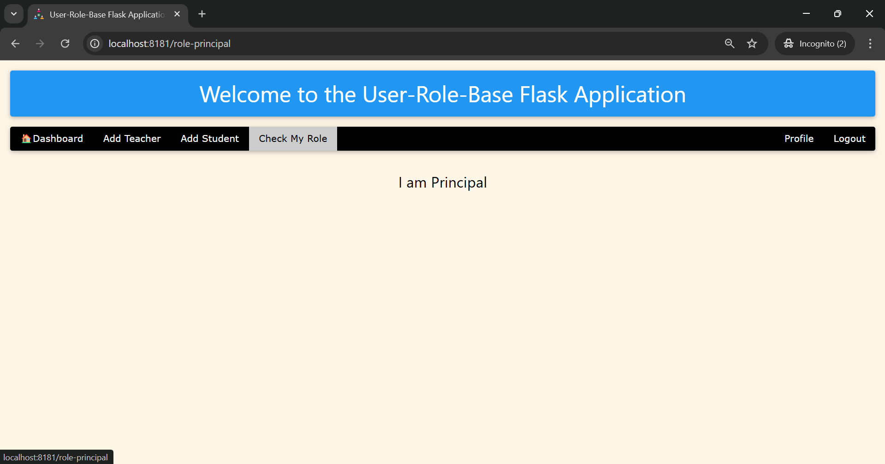
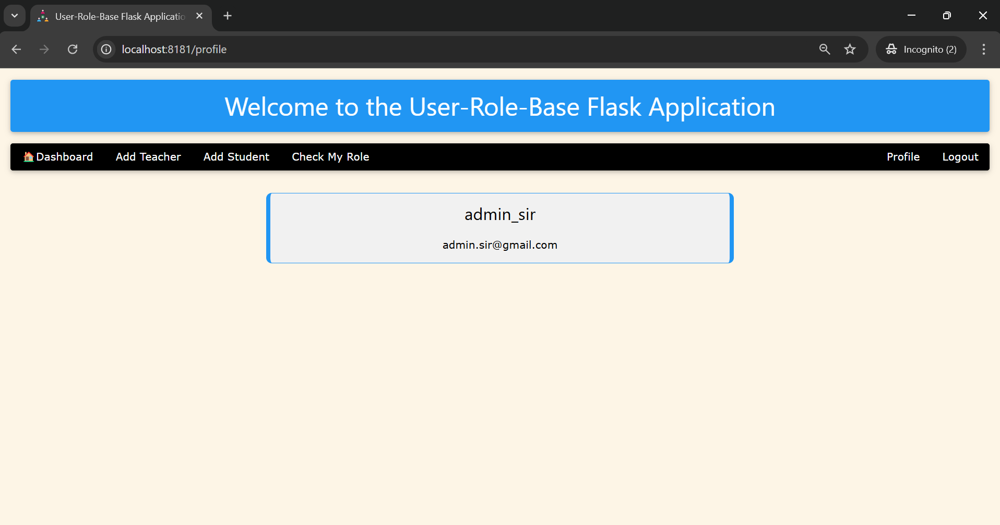
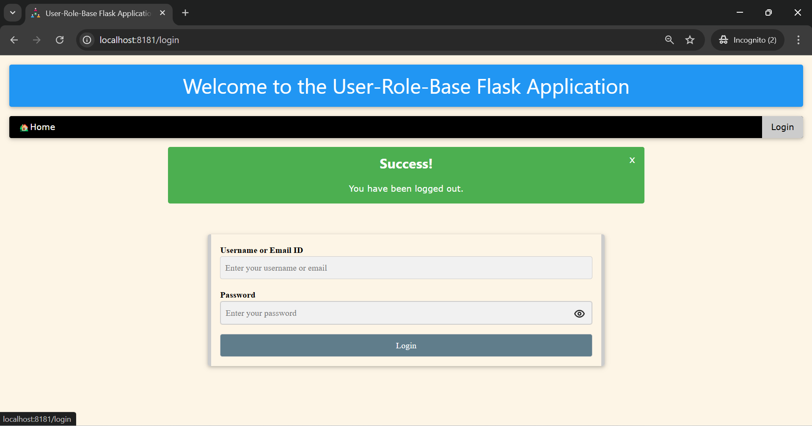

# User-Role-Based Flask Application

## Table of Contents
- [Overview](#overview)
- [Features](#features)
- [Technologies Used](#technologies-used)
- [Installation](#installation)
- [Setup](#setup)
- [Usage](#usage)
- [Routes](#routes)


## Overview
This application is a user-role-based system built with Flask, allowing different user roles (Principal, Teachers, Students) to access various functionalities based on their permissions. The application uses a SQLite database to store user information and provides a simple interface for user management.

## Features
- User registration and authentication
- Role-based access control
- Admin features to add teachers and students
- User dashboards for different roles
- Responsive design using W3.CSS

## Technologies Used
- Python
- Flask
- SQLAlchemy
- SQLite
- HTML/CSS (W3.CSS framework)
- JavaScript (for password visibility toggle)
- Bcrypt (for password hashing)
- dotenv (for environment variables)

## Installation
1. **Clone the repository:**
   ```bash
   git clone https://github.com/jeetendra29gupta/user-role-flask-app.git
   cd user-role-flask-app
   ```

2. **Create a virtual environment:**
   ```bash
   python -m venv venv
   ```

3. **Activate the virtual environment:**
   - On Windows:
     ```bash
     venv\Scripts\activate
     ```
   - On macOS/Linux:
     ```bash
     source venv/bin/activate
     ```

4. **Install the required packages:**
   ```bash
   pip install -r requirements.txt
   ```

5. **Create a `.env` file** in the root directory and add your secret key:
   ```plaintext
   SECRET_KEY=your_secret_key_here
   ```

## Setup
1. **Initialize the database:**
   The database will be created automatically when you run the application for the first time. Make sure the `init_db` function in `models.py` is called in your `main_app.py`.

2. **Run the application:**
   ```bash
   python main_app.py
   ```

3. **Access the application:**
   Open your web browser and go to `http://127.0.0.1:8181/`.

## Usage
- **Register as a new user** (only accessible to the Principal).
- **Log in** with either your username or email.
- **Access the dashboard** based on your role:
  - Principals can add teachers and students.
  - Teachers can add students.
  - Students can view their marks.

## Routes
- `/`: Home page
- `/login`: User login page 
- `/dashboard`: User-specific dashboard 
- `/add-teacher`: Page to add a new teacher (accessible by Principal) 
- `/role-<role name>`: Page to check their role 
- `/profile`: User profile page 
- `/logout`: Log out the user 